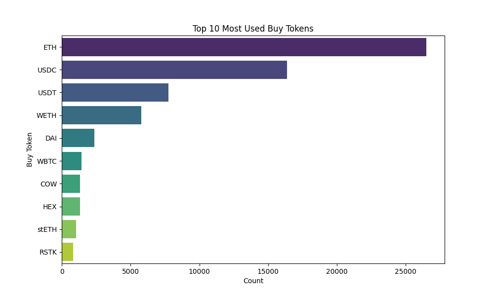
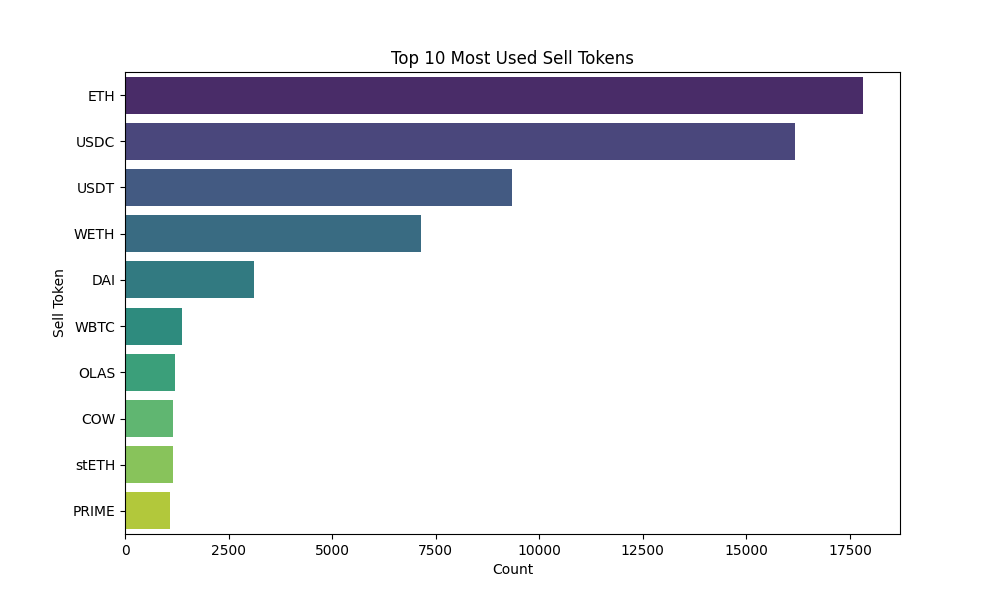
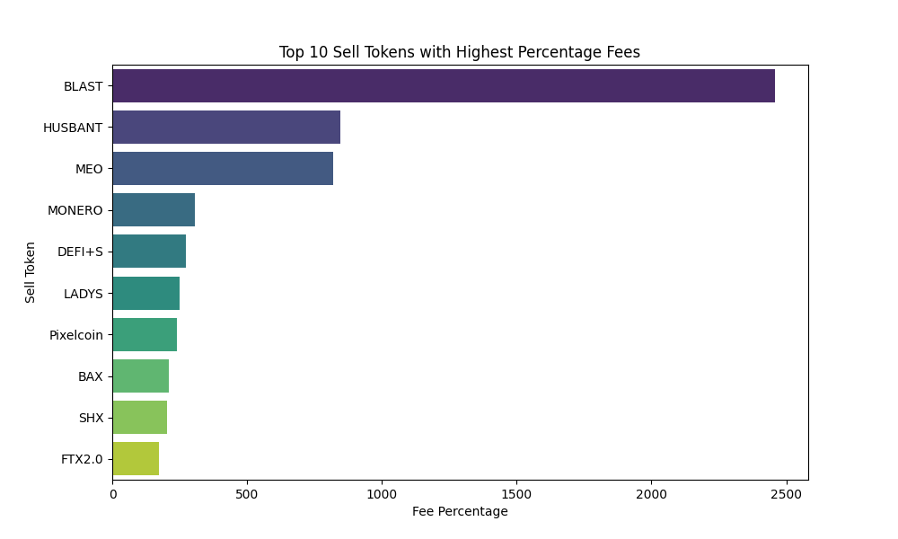
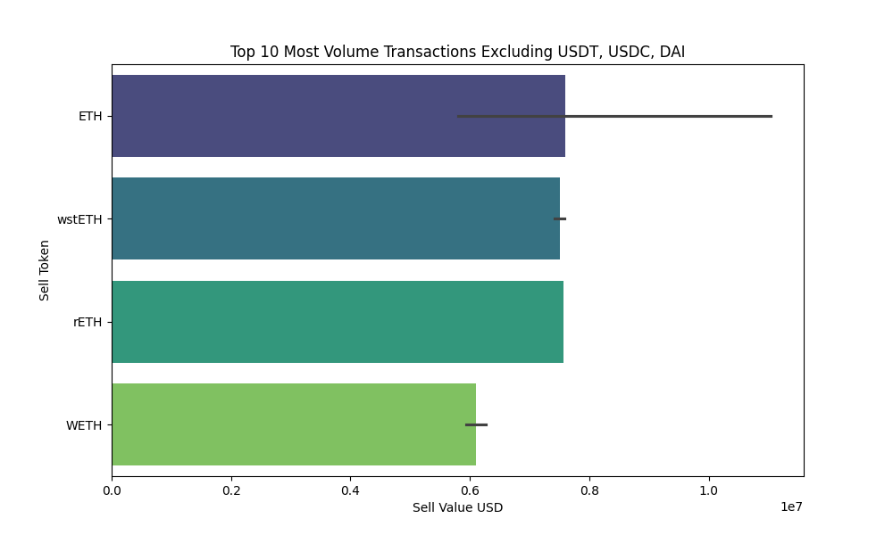

# CoW Protocol Metrics

**Count of transactions**: 109191
**Count of unique transactions**: 85114

## Token Metrics

### Top 10 Most Used Buy Tokens
| Token   |   Count |
|:--------|--------:|
| ETH     |   26498 |
| USDC    |   16388 |
| USDT    |    7739 |
| WETH    |    5766 |
| DAI     |    2371 |
| WBTC    |    1424 |
| COW     |    1341 |
| HEX     |    1338 |
| stETH   |    1054 |
| RSTK    |     822 |

### Top 10 Most Used Sell Tokens
| Token   |   Count |
|:--------|--------:|
| ETH     |   17816 |
| USDC    |   16184 |
| USDT    |    9348 |
| WETH    |    7145 |
| DAI     |    3118 |
| WBTC    |    1380 |
| OLAS    |    1201 |
| COW     |    1152 |
| stETH   |    1149 |
| PRIME   |    1098 |

## Fees Metrics

### Mean Percentage of Fees
2.32%

### Top 10 Sell Tokens with Highest Percentage Fees
| Token     |   Fee Percentage |
|:----------|-----------------:|
| BLAST     |         2458.45  |
| HUSBANT   |          845.052 |
| MEO       |          820.135 |
| MONERO    |          307.64  |
| DEFI+S    |          273.751 |
| LADYS     |          249.757 |
| Pixelcoin |          240.557 |
| BAX       |          210.133 |
| SHX       |          204.327 |
| FTX2.0    |          172.302 |

## Volume Metrics

### Top 10 Most Volume Transactions (Sell -> Buy)
| Sell Token   | Buy Token   |   Sell Value USD |
|:-------------|:------------|-----------------:|
| ETH          | stETH       |      1.10388e+07 |
| USDC         | ETH         |      1.00137e+07 |
| USDC         | USDT        |      1.0006e+07  |
| USDT         | USDC        |      8.32982e+06 |
| DAI          | ETH         |      8.09522e+06 |
| USDT         | ETH         |      8.07241e+06 |
| USDT         | ETH         |      8.01561e+06 |
| USDT         | ETH         |      8.00268e+06 |
| wstETH       | ETH         |      7.58592e+06 |
| rETH         | wstETH      |      7.5693e+06  |

### Top 10 Most Volume Transactions Excluding USDT, USDC, DAI (Sell -> Buy)
| Sell Token   | Buy Token   |   Sell Value USD |
|:-------------|:------------|-----------------:|
| ETH          | stETH       |      1.10388e+07 |
| wstETH       | ETH         |      7.58592e+06 |
| rETH         | wstETH      |      7.5693e+06  |
| wstETH       | ETH         |      7.42082e+06 |
| WETH         | stETH       |      6.32719e+06 |
| WETH         | stETH       |      6.20566e+06 |
| WETH         | stETH       |      5.96667e+06 |
| ETH          | stETH       |      5.94593e+06 |
| WETH         | stETH       |      5.89437e+06 |
| ETH          | USDC        |      5.80093e+06 |

### Top 10 Highest Fees
| Sell Token   |         Fee |
|:-------------|------------:|
| 4CHAN        | 2.90164e+14 |
| Pokemon      | 2.30913e+13 |
| X            | 1.39176e+13 |
| EDOGE        | 5.56191e+12 |
| EDOGE        | 3.04634e+12 |
| EDOGE        | 3.02981e+12 |
| EDOGE        | 2.97364e+12 |
| EDOGE        | 2.94704e+12 |
| EDOGE        | 2.80192e+12 |
| EDOGE        | 2.68574e+12 |

### Median Volume USD per Transaction
| Metric         |   Value |
|:---------------|--------:|
| buy_value_usd  | 5200.91 |
| sell_value_usd | 5113.33 |

### Standard Deviation of Volume USD per Transaction
| Metric         |   Value |
|:---------------|--------:|
| buy_value_usd  |  202651 |
| sell_value_usd |  198400 |